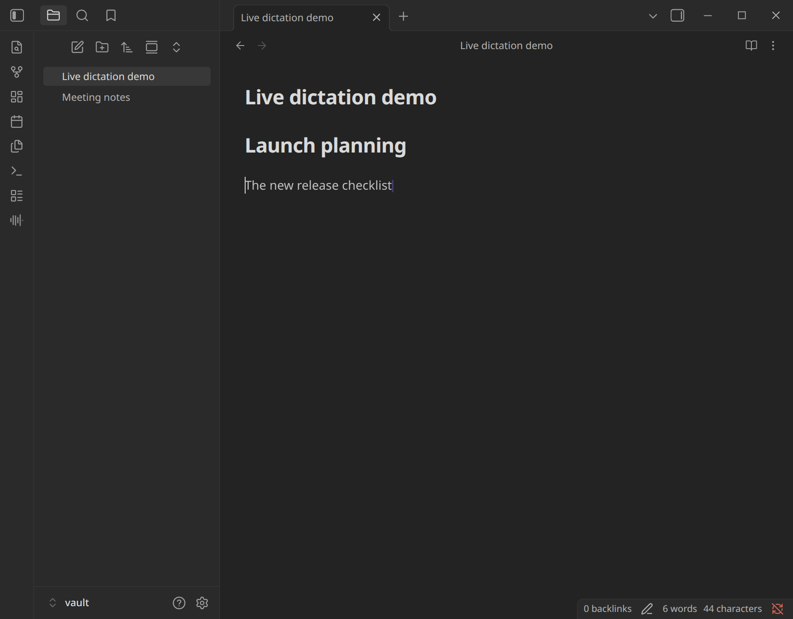
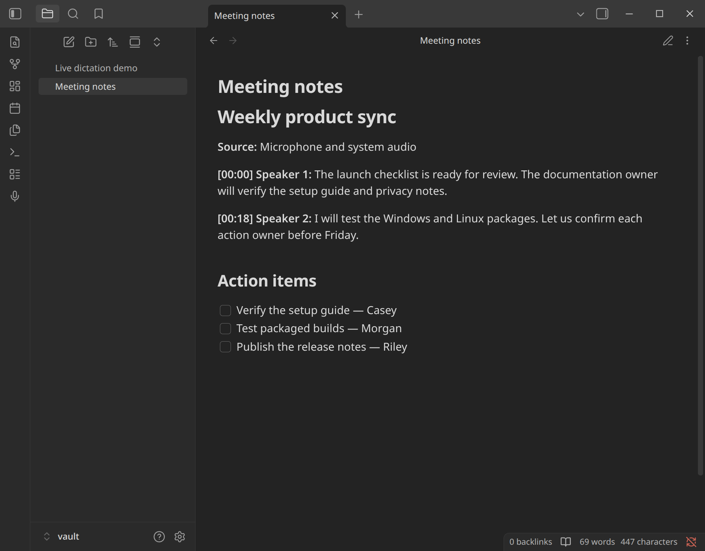
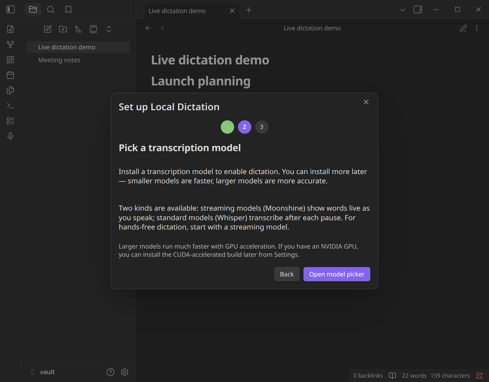

# Local Dictation

**Private speech-to-text, directly in your Obsidian notes.** Dictate voice notes with live text or transcribe meetings from your microphone and system audio. Transcription runs on your device, with no account or cloud service required.

Optional AI cleanup can summarize, extract action items, or reshape a transcript. It stays off until you configure and select it, and audio is never sent for cleanup.

[Install Local Dictation from Obsidian Community Plugins](https://obsidian.md/plugins?id=local-dictation)

## See it in action

_Live Moonshine output captured while the real plugin transcribed a synthetic audio file through Chromium's test microphone._

_A synthetic meeting note demonstrates the system-audio, timestamp, and speaker-label workflow without exposing a real vault._

_The first-run wizard installs the native engine and helps you choose between live and batch transcription._

## Choose your workflow

| Workflow | What happens | Model fit |
| --- | --- | --- |
| **Live dictation** | Provisional words appear and revise in place while you speak. | Moonshine streaming models; experimental Nemotron 3.5 ASR |
| **Notes and drafts** | Final text lands at your cursor after each pause. | Whisper or Cohere Transcribe batch models |
| **Meetings and calls** | Add computer audio to microphone capture, then optionally label speakers and add timestamps. | Whisper or Cohere Transcribe batch models |

Local Dictation supports English, Spanish, German, French, Portuguese, Italian, Dutch, and Japanese with the multilingual Whisper Large V3 Turbo and Nemotron 3.5 ASR models; those models can also auto-detect. Cohere Transcribe, Moonshine, and the `.en` Whisper models remain English-only. All catalog models run locally. Moonshine remains the recommended English live-dictation default; Nemotron 3.5 ASR is the multilingual streaming option. Speaker labels currently require a batch model.

Language choices use base tags (for example, Portuguese rather than a separate
Brazilian Portuguese option). Manual selection gives the most predictable
cleanup. Auto detection chooses one language per utterance; mixed-language
code-switching within one utterance is not yet a quality guarantee.

## Features

- **Live text.** Moonshine and experimental Nemotron streaming models show provisional words and revise them in place until each utterance finalizes.
- **Meeting capture.** Include system audio from meetings, calls, or videos alongside your microphone on Windows, Linux, and macOS 14.2 or later.
- **Speaker labels.** Optional on-device diarization assigns session-stable speaker labels. Set an expected maximum when automatic detection creates extra labels. Speaker embeddings stay in memory and are discarded after the session.
- **Timestamps.** Add elapsed or wall-clock landmarks at intervals, at every phrase, or at Smart paragraph breaks — with sentence-level phrase timing when the model provides it.
- **Local model choices.** Choose Whisper, Cohere Transcribe, Moonshine, or experimental NVIDIA Nemotron 3.5 ASR models and download them from Settings.
- **Optional text transformation.** Clean up, summarize, extract action items, or apply a custom prompt through local Ollama or remote OpenRouter models.
- **Short-lived recovery.** Reinsert the latest finalized utterance, or copy and safely restore the raw text from the most recent replace-style batch cleanup.
- **Explicit remote controls.** Keep transformations local, allow OpenRouter only for oversized transcripts, or disable remote and LLM features entirely.

## Getting started

1. [Install **Local Dictation** from Community Plugins](https://obsidian.md/plugins?id=local-dictation).
2. Follow the setup wizard to download the native speech-to-text engine and a model.
3. On the final step, select **Try dictation now** to begin in the open Markdown note. Or select **Done** and start later from the ribbon microphone or **Local Dictation: Toggle dictation** hotkey. Text lands at your cursor.

The engine and models need a one-time download. Transcription then works without an ongoing network connection.

## Platform support

Published sidecar builds currently target Apple silicon on macOS and x86-64 on Windows and Linux.

| Platform | CPU | Hardware acceleration | System audio |
| --- | --- | --- | --- |
| **macOS (Apple silicon)** | Supported | Metal is automatic for Whisper | macOS 14.2 or later |
| **Windows (x86-64)** | Supported | Optional CUDA on a recent NVIDIA GPU | Supported |
| **Linux (x86-64)** | Supported | Optional CUDA on a recent NVIDIA GPU | Supported through PulseAudio/PipeWire |

macOS and Windows are the primary tested targets. On Linux, the plugin is used daily on Fedora (native and Flatpak); other x86-64 glibc distributions are compatibility targets rather than distro-specific guarantees. See the [Linux support guide](docs/guides/linux-support.md) for package, audio-stack, Flatpak, and troubleshooting details.

If something breaks on your distribution, [open an issue](https://github.com/brittain9/local-dictation-obsidian-plugin/issues).

For GPU requirements and sandbox-specific setup, see the [CUDA setup guide](docs/guides/cuda-setup.md).

## Privacy

- **Transcription stays local.** Audio is processed by the native sidecar on your computer and is not uploaded for transcription.
- **Downloads are explicit.** The sidecar comes from GitHub Releases and is installed with the plugin. Model files come from the source URLs shown in the catalog and use a shared local data directory outside your vault by default.
- **Remote cleanup uses text, not audio.** If you configure and select OpenRouter, it receives the transcript plus any note context you choose to include. Ollama requests stay on your computer through its loopback interface.
- **Remote processing is optional.** You can disable OpenRouter routing or all LLM features from Settings. If you use OpenRouter, configure its provider and zero-data-retention controls to match your requirements.
- **Speaker identity is session-only.** Diarization embeddings are held in memory for the active session and are not persisted as voice profiles.
- **Recovery text is memory-only.** At most one recent utterance and one raw/transformed batch-cleanup record with its document snapshot are retained. Disable retention or use the clear commands to discard them immediately; none of this recovery state is written to disk.

## Contributing

Local Dictation pairs a TypeScript plugin with a Rust sidecar for inference. See [CONTRIBUTING.md](CONTRIBUTING.md) for the architecture, setup, and workflow.

## License

Local Dictation is MIT-licensed; see [LICENSE](LICENSE).

Third-party component and model licenses are documented in [THIRD_PARTY_NOTICES.md](THIRD_PARTY_NOTICES.md) and shown in the model catalog before download.
