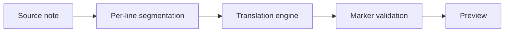

# Vertaalproject retrospectief

## Wat ging er goed

Het team veranderde van richting toen de eerste decoder het latentiedoel miste. Dat verhinderde een technisch indrukwekkende maar frustrerende standaardervaring. Het laatste snelle pad hergebruikt het bestaande installatieprogramma en de catalogus terwijl notitietekst uit de native zijspan wordt gehouden.

Het testen van het eigenlijke modelpakket was ook waardevol. Een bespotte vertaler zou verzoekrouting kunnen bewijzen, maar het kon niet onthullen dat de Japanse tokenisatie de plaatshouders voor privégebruik liet vallen. De real-model test veranderde een abstract risico in een reproduceerbare regressie.

## Wat heeft ons verrast

- Kwaliteitsscores varieerden minder dan subjectieve vloeiendheid suggereerde.
- Een groter model produceerde soms vloeiender tekst tijdens het veranderen van feiten.
- De stroomcondities veranderden de metaaldoorvoer.
- Licenties werden een productbeperking, niet alleen een kennisgevings-bestand taak.

> [!failure] Dit de volgende keer vermijden
> Begin niet met een volledige benchmark voordat de runtime en prompt gates van één zin passeren.

## Wat te veranderen

1. Registreer de toegang tot het modelopslagplaats, licentie, hash, runtime-revisie en exacte invocatie voordat de prestaties werken.
2. Houd benchmarkinputs stabiel en pleeg kwalitatieve monsters.
3. Meet een realistische lange noot vroeg.
4. Stop wanneer een verplichte poort uitvalt, tenzij een ander resultaat de productbeslissing zou wijzigen.

De uiteindelijke aanbeveling moet modelkwaliteit onderscheiden van segmentatiekwaliteit. Als rubrieken en fragmenten zwak zijn omdat de context wordt weggegooid, is een modelruil een dure gedeeltelijke oplossing. Dat probleem hoort in [[Translation Backlog]] ook al blijft de huidige motor de standaard.

## Waardering

De eigenaar testte snel echt Obsidiaans gedrag, de implementatie onveilig gehouden schrijft uit faalpaden, en het benchmarkverzoek leverde expliciete beslissingspoorten. Die duidelijkheid maakte “houd het huidige model” eerder een geldig resultaat dan een teleurstellend niet-resultaat. #retrospective/local-dictation
