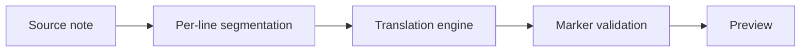

# Retrospectie van het vertaalproject

## Wat heeft goed gewerkt?

Het team veranderde de richting van het proces toen de eerste decoder de gestelde tijdvoorwaarden niet haalde. Hierdoor werd een technisch goed uitgevoerde, maar frustrerende ervaring voorkomen. De finale snelle route maakt gebruik van de bestaande installatiemodule en catalogus. Bovendien wordt de tekst uit het native sidecar gehaald.

Het testen van het echte modelpakket was ook nuttig. Een nepgekoppelde vertaler kon inderdaad de routevorming van de aanvragen bepalen. Maar deze vertaler kon niet ontdekken dat de Japanse tokenisatie de privé-instellingen verminderde. Met het echte model kon een abstraheerde risico’s worden omgezet in een herhaalbare situatie.

## Wat ons verbaasde…

- De kwaliteitsnoteringen wisselden minder af dan het subjectieve gevoel van fluïniteit deed vermoeden.
- Een groter model leverde soms een meer glad verhaal op, terwijl de feiten wel degelijk werden gewijzigd.
- De kwaliteit van de energie die beschikbaar was, heeft het aantal metalen producten dat kan worden geproduceerd, substantieel beïnvloed.
- Licenties veranderden in een productbeperking, en niet langer slechts een kwestie van het indienen van een formulier.

> Probeer dit de volgende keer te vermijden.
[!failure]
> Begin geen volledige benchmark-testen voordat de regels voor het uitvoeren van de testen en de instructies zijn geaccepteerd.

## Wat moet er veranderen?

1. Het recorderen van de toegang tot het modelrepository, de licentie, de hashwaarde, de runtime-versie en de precieze invoer, voordat er met de prestaties wordt gewerkt.
2. Houd de invoerwaarden stabiel en zorg ervoor dat de kwalitatieve eigenschappen van de monsters behouden blijven.
3. Het is belangrijk om een realistische lengte van de brief te kiezen.
4. Stoppen wanneer een verplichte barrière niet werkt. Tenzij een ander resultaat de beslissing over het product kan veranderen.

De laatste aanbeveling moet het verschil maken tussen de kwaliteit van het model en die van de segmentatie. Als de ondertiteling en de fragmenten slecht zijn, omdat de context wordt weggelaten, is een wissel van het model een inefficiënte oplossing. Dit probleem moet worden opgelost via [[Translation Backlog]], zelfs als het huidige model nog steeds als standaardmodel wordt gebruikt.

## Woede/spanning

De eigenaar testte het gedrag van echte Obsidiaan snel. De implementatie hield in dat onveilige schrijvingen werden voorkomen, waardoor er geen fouten optreden. De benchmark-eisen boden duidelijke richtlijnen voor de implementatie. Dit zorgde ervoor dat het behouden van het huidige model een acceptabele oplossing was, in plaats van een teleurstellend resultaat. #retrospective/local-dictation
