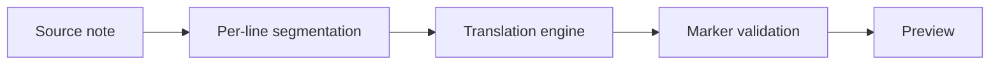

# Translation project retrospective

## What went well

The team changed direction when the first decoder missed the latency target. That prevented a technically impressive but frustrating default experience. The final fast path reuses the existing installer and catalog while keeping note text out of the native sidecar.

Testing the actual model pack was also valuable. A mocked translator could prove request routing, but it could not reveal that Japanese tokenization dropped private-use placeholders. The real-model test turned an abstract risk into a reproducible regression.

## What surprised us

- Quality scores varied less than subjective fluency suggested.
- A larger model sometimes produced smoother text while changing facts.
- Power conditions materially changed Metal throughput.
- Licensing became a product constraint, not merely a notice-file task.

> [!failure] Avoid this next time
> Do not begin a full benchmark before the one-sentence runtime and prompt gates pass.

## What to change

1. Record model repository access, license, hash, runtime revision, and exact invocation before performance work.
2. Keep benchmark inputs stable and commit qualitative samples.
3. Measure one realistic long note early.
4. Stop when a mandatory gate fails unless another result would change the product decision.

The final recommendation should distinguish model quality from segmentation quality. If headings and fragments are weak because context is discarded, a model swap is an expensive partial fix. That issue belongs in [[Translation Backlog]] even if the current engine remains the default.

## Appreciation

The owner tested real Obsidian behavior quickly, the implementation kept unsafe writes out of failure paths, and the benchmark request supplied explicit decision gates. That clarity made “keep the current model” a valid outcome rather than a disappointing non-result. #retrospective/local-dictation
